<div align="center">
  
</div>

<br />

<table>
<tr>
<td width="50%" valign="top">

### About

I build small things, slowly, and try to make them feel right.
Most of what I work on lives somewhere between the browser and a
terminal. I care about details, quiet interfaces, and code that
doesn't shout.

Currently exploring what good software feels like — not just what
it does.

</td>
<td width="50%" valign="top">

### Stack

```text
Languages    JavaScript · TypeScript · Python
Frontend     React · Tailwind · Vite
Runtime      Node.js · Bun
Tooling      Git · Docker · Linux
Curious      Rust · WebGPU
```

</td>
</tr>
</table>

<br />

### Now

> A small section that changes when something interesting does.

- Reading: *something good* — open to recommendations
- Building: a thing I'm not ready to talk about yet
- Listening to: lo-fi, mostly

<br />

---

<div align="center">
  <sub>
    <code>
      &nbsp;·&nbsp;&nbsp;<a href="https://github.com/Kianyce?tab=repositories">repositories</a>
      &nbsp;·&nbsp;&nbsp;<a href="https://github.com/Kianyce?tab=stars">stars</a>&nbsp;·&nbsp;
    </code>
  </sub>
  <br /><br />
  <sub>
    <i>"The best way to predict the future is to invent it."</i> &nbsp;— Alan Kay
  </sub>
</div>
